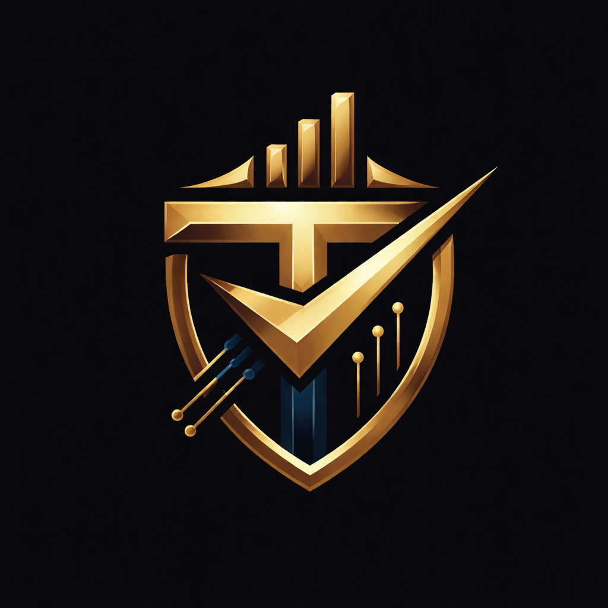

# TeamForge AI 

 
*(Replace this with a screenshot or banner of your app)*

**TeamForge AI** is an intelligent, full-stack project management platform designed to automate team formation, task allocation, and skill development using the power of Generative AI. Built for the modern hackathon spirit, it transforms how teams collaborate, learn, and succeed.

---

##  Inspiration

In hackathons and fast-paced development environments, forming the right team and assigning tasks efficiently is often the biggest bottleneck. Projects struggle with misaligned skills, unclear roles, and a lack of motivation. We built TeamForge AI to solve this by acting as an **autonomous Project Manager** that not only organizes work but also gamifies the entire development lifecycle.

##  Key Features

###  AI-Powered Project Management
- **Smart Task Allocation**: Uses Google's **Gemini 1.5 Flash** to analyze project descriptions and team members' skills, automatically generating and assigning tasks to the most suitable person.
- **Skill Mapping**: Visualize team strengths with dynamic radar charts based on user profiles.

###  Gamification & Rewards
- **XP & Leveling System**: Earn experience points for completing tasks and contributing to projects.
- **Achievement Badges**: Unlock badges like "Top Contributor", "Team Leader", and "Bug Hunter".
- **Dynamic Certificates**: Generate professional, verifiable PDF certificates with custom vector graphics and circular logo clipping (using `jsPDF`).

### Collaborative Documentation
- **Centralized Knowledge Base**: Create and manage project documentation (Guides, APIs, Meeting Notes).
- **Real-time Updates**: Keep everyone on the same page with a unified docs hub.

### Interactive Dashboard
- **Real-time Analytics**: Track project progress, task completion rates, and team efficiency.
- **Project Timeline**: Visualize deadlines and milestones.
- **Glassmorphism UI**: A stunning, modern interface built with Tailwind CSS and Framer Motion for smooth interactions.

---

##  Tech Stack

- **Frontend**: [Next.js 15](https://nextjs.org/) (App Router, Server Components), [React](https://react.dev/)
- **Styling**: [Tailwind CSS](https://tailwindcss.com/), [Framer Motion](https://www.framer.com/motion/) (Animations)
- **Backend**: Next.js API Routes (Serverless)
- **Database**: [MongoDB](https://www.mongodb.com/) (Mongoose ODM)
- **Authentication**: [NextAuth.js](https://next-auth.js.org/) (Google OAuth)
- **AI Model**: [Google Gemini 1.5 Flash](https://deepmind.google/technologies/gemini/)
- **PDF Generation**: [jsPDF](https://github.com/parallax/jsPDF) (Client-side vector generation)
- **Icons**: [Lucide React](https://lucide.dev/)

---

## Getting Started

Follow these steps to set up the project locally.

### Prerequisites
- Node.js 18+ 
- MongoDB Instance (Local or Atlas)
- Google Cloud Console Account (for OAuth & Gemini API)

### Installation

1. **Clone the repository**
   ```bash
   git clone https://github.com/yourusername/teamforge-ai.git
   cd teamforge-ai
   ```

2. **Install dependencies**
   ```bash
   npm install
   ```

3. **Set up Environment Variables**
   Create a `.env.local` file in the root directory and add the following:

   ```env
   # Database
   MONGODB_URI=your_mongodb_connection_string

   # NextAuth
   NEXTAUTH_URL=http://localhost:3000
   NEXTAUTH_SECRET=your_random_secret_string

   # Google OAuth
   GOOGLE_CLIENT_ID=your_google_client_id
   GOOGLE_CLIENT_SECRET=your_google_client_secret

   # AI Configuration
   GEMINI_API_KEY=your_gemini_api_key
   ```

4. **Run the development server**
   ```bash
   npm run dev
   ```

5. **Open the app**
   Visit [http://localhost:3000](http://localhost:3000) in your browser.

---

## How It Works

1. **Onboarding**: Users sign in with Google. The system initializes their profile with a default Level 1 status.
2. **Team Creation**: Users can create or join teams.
3. **Project Setup**: Identify a project goal. The AI analyzes the goal and breaks it down into actionable tasks.
4. **Execution**: Team members work on tasks. Completing tasks updates the project status in real-time.
5. **Rewards**: As tasks are completed, users earn XP. Reaching milestones unlocks badges and generates a personalized certificate of achievement.

---

##  Challenges We Ran Into

- **PDF Generation**: We initially struggled with `html2canvas` for generating certificates, as it failed to capture complex CSS styles and high-resolution images accurately. We pivoted to a **vector-based approach using `jsPDF`**, manually drawing the certificate layout and implementing custom canvas clipping for circular user avatars/logos to ensure pixel-perfect, printable results.
- **AI Consistency**: Tuning the prompt for Gemini 1.5 Flash to consistently output structured JSON for task allocation required several iterations of prompt engineering.

---

##  What's Next for TeamForge AI

- **GitHub Integration**: Automatically verify skills by analyzing users' public repositories.
- **Smart Interviews**: An AI interviewer that vets candidates for teams before they join.
- **Mobile App**: A React Native companion app for managing tasks on the go.

---